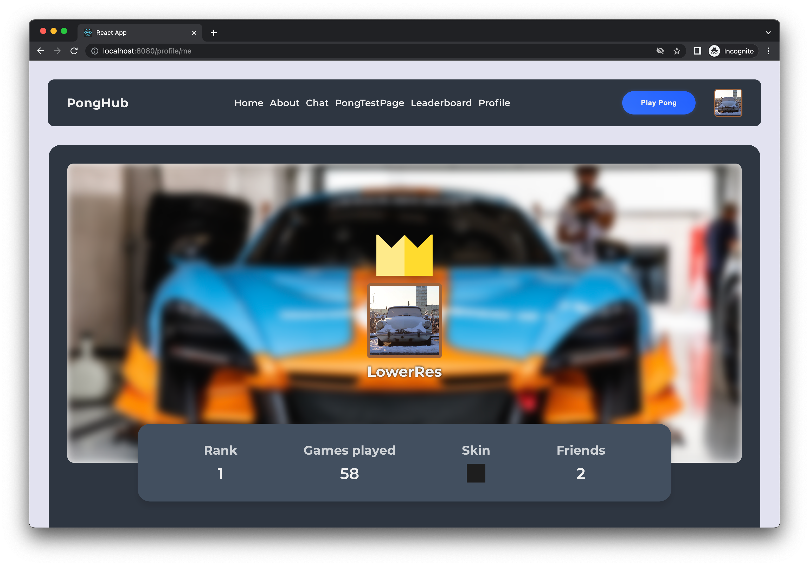

## Transcendence

Online competitive pong made easy

Built by: <a href="https://github.com/rubennijhuis">rnijhuis</a>, <a href="https://github.com/zenololtan">ztan</a>, <a href="https://github.com/angeli-sk">akramp</a>, <a href="https://github.com/Maxberkenbosch">mberkenb</a> and <a href="https://github.com/juvan-de">juvan-de</a>



### Quick start

Requires that <a href="https://www.docker.com/">Docker</a> is installed

```
$ make
```

### Extra Features

Chat:
Pictures
Complex invites

Pong game:
Side preference
3D assets

### Folder structure

```
Front-end # Hosts the front-end code
Back-end  # Hosts the back-end code
Nginx     # Entry point for all requests
PgAdmin   # bro idk
...
...
```
